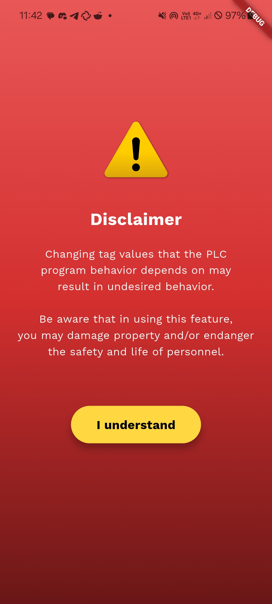
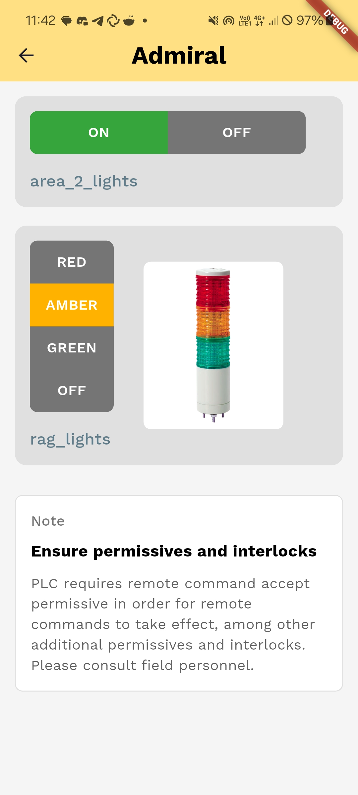
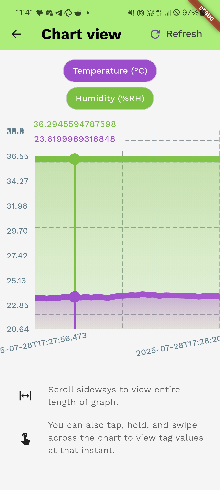
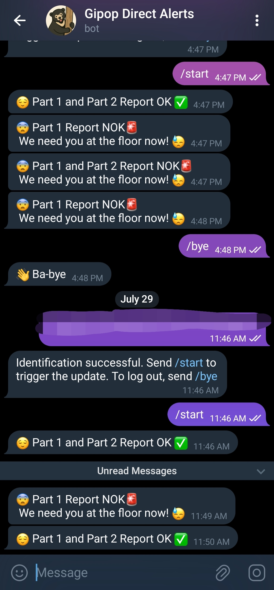

+++
title = 'How I built a PLC for my internship project: or how it made me love open source even more'
date = 2025-08-06T09:14:52+08:00
draft = false
+++

  
  <figcaption>Electronic rat nest. The PLC itself is just a real-time app running on Linux PREEMPT_RT on the Raspberry Pi 5.</figcaption>
   

I remember vividly the moment the term 'PLC' was first used in a relevant context I was participating. It was during an Instrumentation & Controls lecture at UTP. My lecturer threw out the term 'PLC' to the class, expecting us to at least know what it meant.

At the time I was sure I've seen the term before somewhere, but I never really understood what it meant at the time. Even today, the term has a pretty nebulous definition, but I digress for the time being. Somebody then asked him what a 'PLC' is (mind you, we were all third-year electrical engineering students at that point) and he took a substantial pause before defeatedly answering that it's basically an Arduino.

I took it as gospel at the time and had no qualms with that answer. But pedantic me today (and I'm sure many others in industrial automation) would take issue with the word 'Arduino' even sharing the same sentence with the term 'PLC'.

## What even is a PLC?

A PLC stands for <ins>P</ins>rogrammable <ins>L</ins>ogic <ins>C</ins>ontroller. Now any machine, even non-Turing-complete ones can fit that definition, because a PLC describes function, and its name alone does not prescribe an exact physical manifestation.

But in real life, it's a bit more complicated than that. The IEC 61131 standard is possibly the best reference documentation that standardizes PLCs. But again, there are no certifying bodies (yet) out there that control the use of the word 'PLC'.

What this essentially means is, a PLC is practically any sort of device, software or hardware that is _programmable_ in the way it _controls_ _logic_. While not in the name, a PLC has to at least control something that has an immediate physical effect, or is doing something that depends on anything undergoing physical effects (e.g., reading a sensor).

> So is a naked Arduino board a PLC?

Unfortunately going by the definition above, yes. But nobody in their right mind will put one in a control cabinet and expect it to run a production line. So here's a revised definition, with more restrictions:

### A PLC is anything that satisfies the following:

1. Software or hardware that is programmable.
2. Software or hardware that controls logic.
3. Software or hardware that is bound to events involving physical effects.
4. Can be inspected online (live editing of variable values).
5. Can be reprogrammed while hot (online changes of code without stopping execution).
6. Is hardened or may live in a hardened physical vessel to withstand abuse from vibration, EMI, heat, humidity, etc.

## Why I picked this project

Because of this forum rule I found somewhere:

> No watercooler complaints: you’re allowed to
> complain about something in direct proportion to
> how much work you’re doing to improve said thing.

Throughout the internship I was exposed to three PLC vendors: Siemens, Rockwell, and Beckhoff. I dislike all of their products, price tag, licensing schemes, and the closed-source nature of their products. All of their IDEs require Windows to run (no I refuse to acknowledge Simatic AX and PLC++, at least for now).

Among all of them Beckhoff was the most tolerable. They invented EtherCAT, my favorite real-time fieldbus protocol. TwinCAT is fine. ADS is ok, I guess. But I really don't like being bogged down by substandard corporate decisions. I should not be forced to use Windows, and going closed-source when you're a company that large is purely a bad cultural **and** business decision.

Seriously, stop imitating Apple. Stop it with these ridiculous walled garden ecosystems.

So part of the reason why I embarked on this toy project is to run away from these vendors. I understand that it amounts to essentially reinventing the wheel, but it's far from a pointless endeavor.

## Architecture

  

Everything is a user-space process on Linux with the PREEMPT_RT patches applied. Real-time processes are run with appropriate thread prios on `SCHED_FIFO`. The Pi 5 is just a stand-in for a ruggedized IPC. It was the cheapest device I could get my hands on that runs Linux easily.

Since the PLC and other glueware are all software, it can live in an industrial PC, satisfying requirement [**6.**](#a-plc-is-anything-that-satisfies-the-following). I didn't satisfy **4.** and **5.** due to time constraints, but that's something I'll be fixing [soon!]()

The figure above is motivated by my desire to explore as many technologies I could. Nothing prevented me from implementing the Telegram bot in Go or Java, but I really wanted to learn Zig, so I decided to write that part in it.

Repo of the core PLC runtime and glueware available [here](https://github.com/andergisomon/Gipop).

### Slight tangent

That decision led into a rabbit hole with CMake, and I ended up learning lots! The folks at iceoryx2 were friendly enough to let me write short docs for other users to cross-compile iceoryx2 to ARM. It was my first ever 'real' contribution to open source. Nothing substantial, but it was nonetheless my [first merged PR](https://github.com/eclipse-iceoryx/iceoryx2/pull/873).

Though, James, the man behind embedded-graphics and EtherCrab did offer me a baby's first steps PR to fix this [cryptic bug](https://github.com/ethercrab-rs/ethercrab/issues/307) that originated from EtherCAT firmware shenanigans (it was undocumented SyncManager types on a BK1120 coupler, from Beckhoff themselves!). My noob ahh did something like this:


if sms.len() as u8 != num_indices {
    let mut i = sms.len() as u8;
    while i > num_indices {
        sms.pop();
        i -= 1;
    }
}


I refused the offer on the grounds that I didn't want to pollute a codebase I'm unfamiliar with. James' [classy way](https://github.com/ethercrab-rs/ethercrab/commit/33f53d4f6f188647cea2390e8f69bd9f7bce743c) was to use `zip()` on two iterable types that were already in scope. It returns the shorter of the two, so we don't need to pop anything.

## Mobile app

<table style="display:block; margin:auto; max-width: fit-content;">
  <tr>
    <td>
      
    </td>
    <td>
      
    </td>
    <td>
      
    </td>
  </tr>
</table>
<!-- Insert all the mantadsodu pics here -->

I made a simple Flutter app that just talks to the Supabase instance I had on Free tier. None of that 2-variables-on-free-plan Arduino Cloud crap. I could add as many tables as I want with as many columns and rows my heart desired. I humbly say that the UI turned out looking pretty nice. Repo available [here](https://github.com/andergisomon/mantadsodu).

## Telegram bot

<table style="display:block; margin:auto; max-width: fit-content;">
  <tr>
    <td >
      
    </td>
    <td>
      
    </td>
  </tr>
</table>
<!-- Insert the telegram bot pics here -->

The Telegram bot just subscribes to a publisher inside the PLC control loop process via IPC (using iceoryx2). I used [zigtgshka](https://github.com/Nyarum/zigtgshka) to interface with the Telegram bot API and the iceoryx2 C FFI. Repo available [here](https://github.com/andergisomon/sunsuyon). Since Zig has no syntactic async, I just assigned a separate thread each for the IPC worker and the Telegram bot.

## Wiring it together

  

Fortunately it was all smooth sailing. The biggest hurdle was ensuring I didn't mess up any of the wiring to mains to feed the PULS power supply. All thanks to my trusty DMM. But honestly scanning through all the datasheets was tedious.

The only initial issue I had was setting up passwordless SSH. Turns out the identity file was stored somewhere unexpected. That, end dealing with a +1 Modbus address offset in ModbusTools. Strangely, using `tokio-modbus` was easier than figuring out how to use the ModbusTools client.

The main fieldbus is EtherCAT, a real-time, Ethernet-based fieldbus protocol. It has to live on its own network. Though surprisingly, I did try it out on a regular unmanaged switch once with IP traffic buzzing through. It would occasionally timeout but still surprised that it worked. Anyways, don't do that on a non-TSN switch.

I also bought a Cytron IRIV IO. Inside is an RP2350A and a W5500, so it can be programmed as a remote Modbus/TCP IO extender. I borrowed the EtherCAT and EnOcean hardware from my supervisor. The EtherCAT network consisted of two couplers: an EK1100 and a BK1120, each with their own terminal cards.

I needed the BK1120 to interface with the KL6581 and KL6583, both needed to interface with the PTM200 EnOcean transmitter. EnOcean devices are pretty wild. The PTM200 is completely batteryless, telegrams are transmitted wirelessly using the energy from the button press. Decent range through walls too.

## Full report

If you want to read the full 76-page report, [here you go.](report.pdf) You can skip the boring details straight to the appendices for more details.