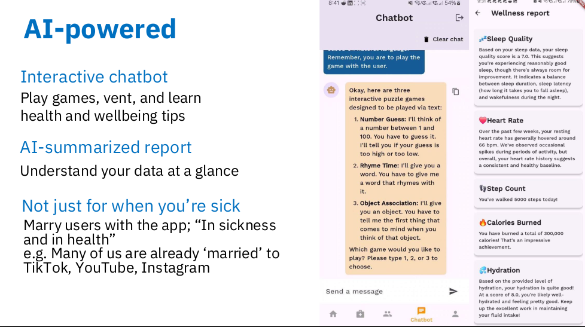

+++
title = 'Becoming 2nd Runner-up of VHack 2025'
date = 2025-04-27T10:47:14+08:00
draft = false
+++

  
  <figcaption>Our Team: The Interns - Left: Me; Right: <b>Mclaren</b></figcaption>
   

Well. Here I am again. It's been almost a year since one of the most unforgettable [moments](/posts/exxonmobil_dataworks/) of my life happened. Between that, so many things have happened. Ever since my internship commenced, I've been free of coursework and I've started to seriously think about where my life is headed, and what opportunities out there just waiting to be pounced on. I learned a lot, and I'm still learning, and there's a lot left to be learn, unlearned, relearned. Whatever knowledge the world can offer; I'll never live long enough to learn them all, but at the very least I didn't sit idly by and took the effort to try.

Yesterday was the finals for the USM Varsity Hackathon 2025 (VHack 2025). Me and Mclaren spent a whole day at Universiti Sains Malaysia (USM). We fully expected to come back with absolutely nothing, and a consolation prize at most. Because the truth is, our submission was nowhere near as complete as the other contestants. It was comically barebones; so much so that both of us kinda feel bad about winning. I personally looked at the repos for the other contestants. They've put in a lot of effort. I've been in their shoes, and I know that many sleepless nights went into building those React apps.

  
  <figcaption>In USM's Dewan Kuliah S</figcaption>
   

Well, to be fair, as *The Interns*, both of us worked full time. We could only really work on it after work and on weekends. I think a combination of luck and oratory skills was what persuaded the judges. My impression of the marking allocations for the finals pitch was that it was predominantly a matter of making money with your idea. We understood the assignment. We had to believe in our solution as if we were *regnum fidei dēfēnsōrēs*. And we had to stand out. After a long day of work we soldiered on adding on as much as we could before the deadline. Lacking sleep on Saturday, we left for USM criminally underdressed.

I said YOLO and picked the most 'professional' collared shirt I had—a red ExxonMobil shirt. The hue alone accentuated even more the fact that we were underdressed. I guess visually standing out helped. During the pitch I tried my hardest to make us stand out and to signal to the judges that our ideas weren't completely garbage. Most teams stood near the laptop, seemingly afraid of the judges. I told Mclaren that if we want any chance of going home not *[muli kampis barait](https://ms.wiktionary.org/wiki/muli_kampis_barait)*, we needed to stand directly in front of the judge, away from the laptop.

Both of us went micless. It's my personal rule: If your audience is close enough and the room isn't too big, you have to use your own voice. Mics are evil. They make your diaphragm and pharynx complacent. When you force yourself to speak without the aid of a microphone, you will naturally enunciate your words more clearly. I supposed we made a good enough impression on one of the judges. So much so that he walked up to us afterwards to ask us further questions.

The other judge was harder to captivate. His question hit directly at our weakest spot. It was somewhere along the lines of:

> "What's so special about your solution that no one else had?".

Well I took the copium and prefaced my answer with

> ~"All of us are here today using open source ideas and open source frameworks...".

I then asked him to clarify whether he's asking if we actually coded anything we promised, and fortunately he clarified that he's asking about whether or not our idea is *novel*, and that was way easier to answer. So in the end I then switched my gaze to the entire audience and proclaimed that:

> ~"Research has shown that LLMs are our best bet on diagnosis... blahblahblah RAG blahblah graphRAG blahblah none of our competitors do this at all".

I personally do think that at least for aiding medical professionals in diagnosis that an agentic workflow + graphRAG is our best bet. But my personal ethics don't agree with allowing a fancy stochastic next-token predictor to have anything to do with the difference between wellbeing and injury, or death. Nevertheless, I had to at least appear like we believed in our solution.

  
  <figcaption>Mclaren's medicine tracker</figcaption>
   

Now at this point you may have wondered what the solution that we pitched even was. I didn't mention it earlier on in this article because it was completely vanilla UNSDG stuff. What we built was a Flutter app that tried to combine EHR with a boutique online shop for medical supplies and supplements, while also integrating telehealth. It was a hodgepodge of everything remotely related with digital medicine, a last ditch attempt to make our proposed solution seem 'different' than the others.

  
  <figcaption>Like salt to a dish; Just add more capitalism</figcaption>
   

  
  <figcaption>And of course, who could forget: AI.</figcaption>
   

The truth is, I'm more than willing to trade prizes with the other teams in our domain. In my eyes they showed true potential. They delivered a product with way more working features. One team in particular implemented OCR for automatically registering medicine. That's an actually useful feature. Another team of three girls touched on an important topic, mentioning PdPA, GDPR, and HIPAA compliance. They had solid presentation skills, showed planning and great teamwork. Unfortunately like in the real world, it mostly boils down to how well you can sell something.

To the youngins, look at the world around you and carefully observe the mechanisms that keep society running. Look at how much we spend on products that don't actually offer you much in return. And most importantly you need to understand the interests, desires, and dislikes of a group of people. Convey your pitch in terms of the things they're familiar with and have an affinity for. Best of luck for all the things to come.

Before signing off I'd like to thank the sponsors and organizing committee of VHack 2025 for making everything possible. Thank you for the opportunity.
