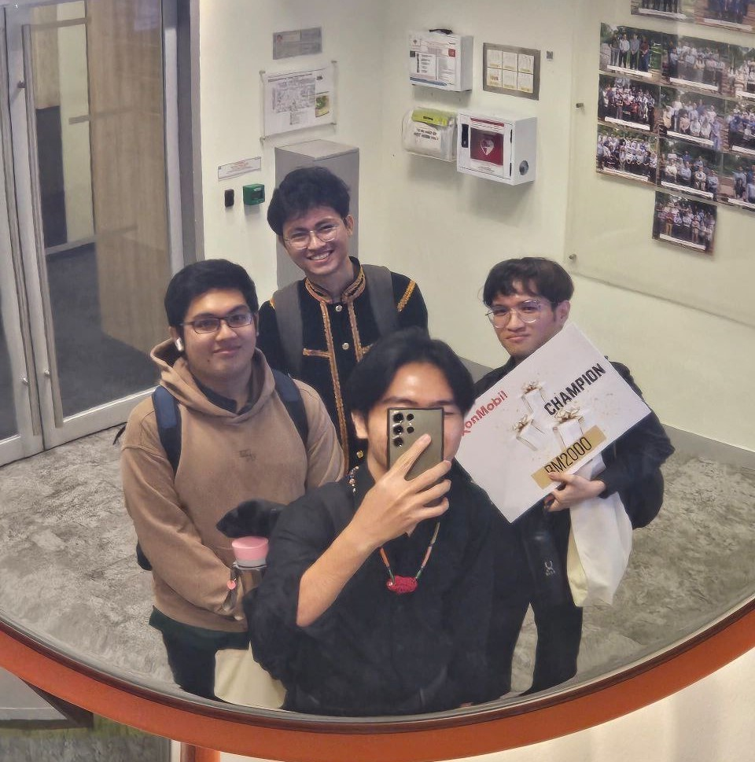
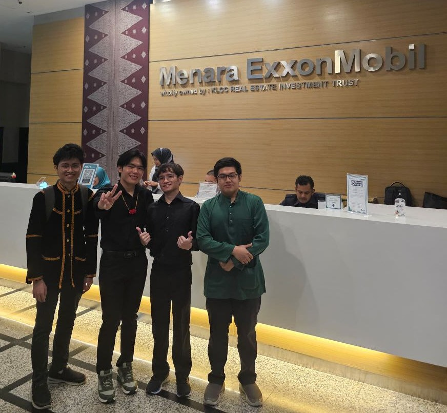

+++
title = 'Becoming Champion of ExxonMobil DataWorks 2024'
date = 2024-10-17T19:47:06+08:00
draft = false
+++

  
  <figcaption>That's me in <i>gaung Kadazan</i> at the back in the middle :)</figcaption>
  <figcaption>The Pat Nyem Ake' - Left: <b>Eddry</b>; Middle, front: <b>Zech</b>; Right: <b>Mclaren</b></figcaption>
   

It's been a while since I updated my site. A lot has happened since then. I'm now in the first semester of my third year at UTP. This will be my last semester on campus before embarking on an internship, away from campus, and away from home. It's honestly been such a journey so far, and in this post I'm gonna share a part of that journey. One of the best memories I have ever made.

It all started almost a month ago, when an email appeared in my inbox. It was broadcast to students from various programs, calling for teams to participate in a competition I haven't heard of at the time. The ExxonMobil DataWorks Challenge. It was first held 2 years ago in 2022, and this year was the second ever.

I didn't think much of the challenge back then; I thought it was gonna be a piece of cake that would take at most 2 hours. It's actually my first ever data science-ish competition (crazy that it also happened to be the first we won), but I kinda already knew the gist of these challenges. They'll dumb down a problem statement, give some nice, clean, data that fits in a single .csv file. Basically, cookie cutter solutions for cookie cutter problems.

> Spoiler alert: I was wrong.

Well, at least the first DataWorks went a bit more like that; from asking one of the brains behind the whole challenge.

The competition went like this: They'll give a prompt and we had 2 weeks to solve the problem. Deliverables included code, visuals, written documentation, and a video. Afterwards, only 5 teams were chosen for the finale. The finale was a pitch at Menara ExxonMobil.

I never expected for us to make it in the semifinal, let alone come back home as champion. We were on the verge of giving up, but we worked through the problem and found a solution last minute. I still remember that day like it was yesterday. The submission was due on 11am, Saturday.

We worked on it until 7am from 9pm the previous day. Mclaren carried the team with his video editing and direction, but unfortunately Premiere glitched out on us in the last minute so the video we submitted had random spots of no audio. At around 9am, I realized there was a slight error in the documentation, and fixed it in the last minute, when my other teammates had already hit the sack.

## Behind the team name



 
<figure>Zech explaining the team name</figure>

This was the second time I pestered Zech to come up with a team name in Kayan. The first one was Robofun, where we named our team "Telo' Teloh" (three eggs) but we pulled out of the competition early because it was hard to get the robot to work, and team morale was declining; so I don't regret pulling out. Anyways, back to the topic.

Zech then came up with the phrase "**Pat Nyem Ake'**" which means *Four Bachelors*, in both senses of the word. We were 4 unmarried guys, who are also bachelor students in electrical and electronics engineering. When I submitted the application, I added the initials "PNA", in case the DataWorks team find the full phrase hard to remember.

My reasoning for coming up with an unusual name was simple. In Malaysia, people have this colonialist sickness where they find it hard to imagine that they, too, have the power to name something after anything that reflects their culture, language, background, etc. Most of us rely on techy, meaningless English words that are so easily forgettable. Not to throw shade on the other teams, of course; but that's fact.

## How we made the cut

> TL;DR: It was our loss function.

Yep. That's it. I'm sure many other teams delivered models that worked. Maybe not *excellent* models, but they *worked*. But I think a lot of teams ended up not submitting, or submitted models that didn't work. Looking back, it was not a trivial problem to solve. We were given a dataset that consisted of multiple reservoirs. Each reservoir had a spatial and temporal data associated to it.

Spatial data refers to physical properties associated to each discretized points in space. Temporal data refers to the production numbers for each reservoir. We were expected to produce a model that produces production forecast given the spatial data for any particular reservoir.

Our solution was to just transform the spatial features with an LSTM layer, and feed it forward into two more LSTM layers with 1D Global Average Pooling to match the tensor dimensions of the temporal data. Our solution wasn't the most elegant or novel, but it worked. Another team from MMU used autoencoders and self-attention to match up the spatial and temporal data. Now, when they revealed that during their pitch my jaw literally dropped.

It never occurred to me that you can use self-attention like that. I couldn't detach it from the context of NLP. It was such an elegant solution, and the MMU team would have definitely bagged the champion spot if it weren't for some logistical issue at their side.

The problem with ours initially was the predictions weren't cumulative at all like the training data. It went above our heads and was caught by our supervisor the day before submission was due. Eddry broke the news to me while I was on the toilet, and I came up with adding a penalty term to the loss as a really patchy way to get the predictions to be cumulative.

At first I couldn't find anywhere online on how to code it up. ChatGPT returned garbage answers as it usually does for anything non-routine. I doubted my idea and I realized where my code was wrong while showering. There was less than 20 hours left until submission and I quickly fixed my code that night. It worked.

## Marketing, marketing, marketing

There were 2 mentoring sessions with ExxonMobil employees to improve our slides. Thanks to their advice we put out a solid presentation. Thanks to Zech's PowerPoint skills especially, the smooth animations looked cool and most importantly, sent the points home.

We hadn't named our approach yet, because to me adding a penalty term warranted nothing novel. So we just called it 'custom loss'. For the pitch, however, we gave it a Kadazandusun name. I called it "Kuminuru'", which means "[I] was squatting". Because that's what I was doing on the toilet when I came up with the idea.

## So, what's next?

We received the prize. (I won't disclose what it was but it's not what you think from seeing the RM2000 placard! :upside_down_face:). We took some pictures. We stayed around until almost 5:00pm, at that point we skipped dinner because it was KL and Mclaren drove us there (though Eddry was already in KL for a debate competition the night before). Mclaren drove us back from KLCC and through the E1 stretch of the *Lebuhraya Utara Selatan*. Zech then drove us from Gopeng into our dorms. We all held licenses but if I were given the wheel that night we would've ended up in a ditch probably :skull::skull::skull:.

It was quite an experience. Definitely one of the most unforgettable. The culminated time we worked on it was only about a month, but the journey felt quite a bit longer than that. I think winning was a bonus, but we never really set our sights on that. What we really only cared about was the fact that we worked on a problem together, and there is nothing else a human being can experience as satisfying as that.

<figcaption>One last picture before going back to UTP.</figcaption>
 



 
<figure>A brief snippet of my part (we only had 10 minutes total).</figure>



 
<figure>A brief snippet of Mclaren's part.</figure>



 
<figure>A brief snippet of Eddry's part.</figure>

*Last updated 15 August 2025*